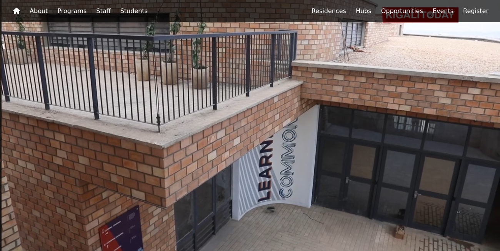
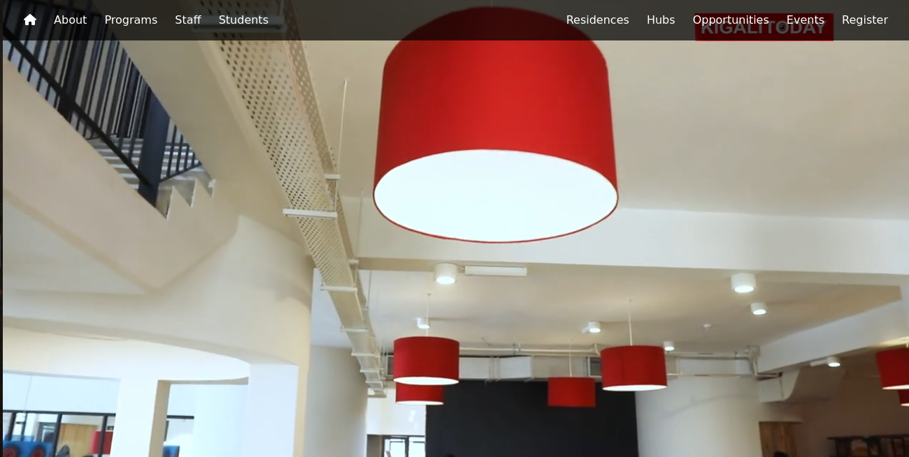
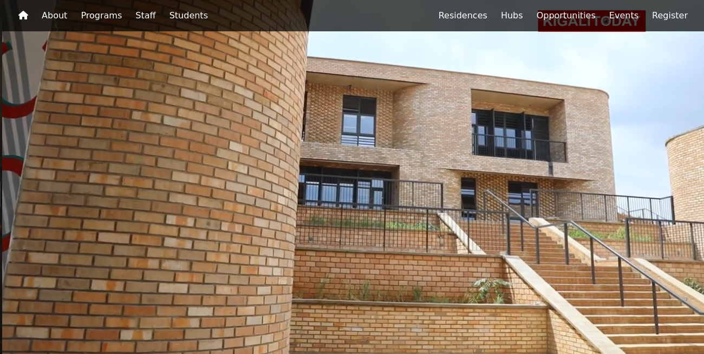
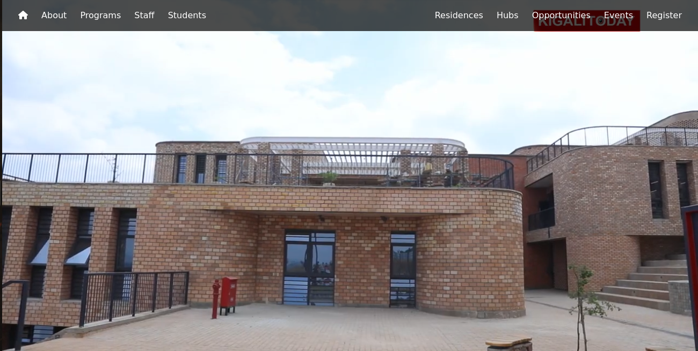
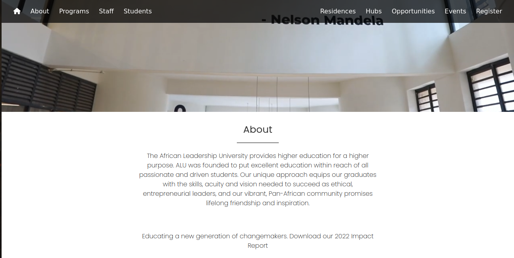

# Visit ALU With Html and **css**
This project contains Visit Rwanda Website done with HTML and CSS, this repository is for educational Purpose and people who are interested in frontend development.

## Author
**Chance KARAMBIZI**
## Screen Shots of Output

**Landing Page View One**

**Landing Page View Two**

**Landing Page View Three**

**Landing Page View Four**

**Landing Page View Five**

## Usage
### Steps
 1. Clone Repository
  
        git clone https://github.com/MihNan/visit_alu.git

 2. Step Two

    open visit_alu Folder in your downloads folder

3. Step Three

    open index.html in your browser

## License
        [MIT License](LICENSE)

Feel Free to create Folks and don't hesitate to reach if encounter an issue or idea.

### Contact Me
        Email: karambizi2chance@gmail.com
        Phone: +250788991010

## Happy Coding !!